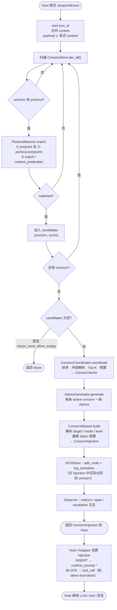

<p align="center">
  
</p>

# OpenCOAT Runtime 详细系统设计 v0.2

> 本文档是对 [`v0.1-complete-design.md`](v0.1-complete-design.md) 的工程化展开。
> v0.1 定义了**概念与运行机制**，本文档定义**模块边界、接口、协议、目录结构、部署形态、运维与演进路线**。
> 范围：从单文件 demo（in-proc 模式）一直到独立 daemon + 多 host 插件的服务化形态。

---

## 0. 与 v0.1 的关系

| 维度 | v0.1（完整设计） | v0.2（系统设计） |
| --- | --- | --- |
| 焦点 | Concern / DCN / AOP 机制的概念定义 | 工程结构、模块拆分、接口、协议、运维 |
| 目录 | 单包最小目录 (§27) | 多 package 工作区，含 host 插件、daemon、CLI、协议、文档 |
| Host 接入 | 抽象 `host_adapter.py` | `host-sdk` + 插件目录 `host-plugins/openclaw|hermes|langgraph|autogen|crewai|custom` |
| 运行形态 | 流程描述 (§21) | in-proc、sidecar、daemon-server 三种部署拓扑 |
| 存储 | 提到 ConcernStore | 多后端 backend（memory/sqlite/postgres/jsonl/vector） |
| 三循环 | 概念描述 (§22) | 调度器 + worker + heartbeat 服务 |
| 协议 | 提到结构化对象 | JSON Schema / OpenAPI / 可选 gRPC |

v0.1 是"用什么思想"，v0.2 是"如何把它造出来并跑起来"。

---

## 1. 设计目标与非目标

### 1.1 设计目标

1. **概念与实现 1:1 可追溯**：v0.1 中每个名词（Concern、Joinpoint、Pointcut、Advice、Weaving、DCN、COPR、Concern Vector、Concern Injection）在代码中都有唯一的归属模块和数据契约。
2. **Host-agnostic**：核心运行时不依赖任何特定 host（OpenClaw / Hermes / LangGraph / AutoGen / CrewAI），通过 `host-sdk` + adapter 插件接入。
3. **可嵌入也可独立运行**：同一份核心库既可作为 in-proc 库嵌入 host 进程，也可作为独立 daemon 通过 IPC（Unix socket / HTTP / gRPC）服务多个 host。
4. **可替换的子系统**：存储、LLM、Embedder、Matcher、Advisor 全部走 ports & adapters（六边形架构），通过 entrypoints 发现插件。
5. **可观测**：每个 Concern 的激活/编织/验证/演化都有 trace、metric、structured log。
6. **MVP 友好**：默认 `memory` + `stub-llm` + `inproc` 即可跑通完整 turn-loop，不需要任何外部依赖。

### 1.2 非目标（MVP 阶段）

- 不做复杂神经网络的 DCN 学习（v0.3+）
- 不做完全自动生成 Meta Concern（v0.3+）
- 不做 token-level rewriting 工具（v0.3+）
- 不做跨 agent 的 DCN 联邦（v0.4+）
- 不做实时风险闭环执行（v0.3+）

---

## 2. 架构总览

### 2.1 五层架构

```text
┌───────────────────────────────────────────────────────────────┐
│  L5  Host Agent Layer                                         │
│      OpenClaw / Hermes / LangGraph / AutoGen / CrewAI / 自研   │
└─────────────────────────┬─────────────────────────────────────┘
                          │  uses
┌─────────────────────────▼─────────────────────────────────────┐
│  L4  Host Adapter Plugins                                     │
│      opencoat-runtime-host-plugins/{openclaw,hermes,langgraph,...} │
│      把宿主事件 → joinpoint，把 injection → 宿主可消费的形式      │
└─────────────────────────┬─────────────────────────────────────┘
                          │  opencoat-runtime-host-sdk
┌─────────────────────────▼─────────────────────────────────────┐
│  L3  Transport / IPC Layer                                    │
│      inproc | unix-socket | http(json-rpc) | grpc             │
└─────────────────────────┬─────────────────────────────────────┘
                          │
┌─────────────────────────▼─────────────────────────────────────┐
│  L2  OpenCOAT Runtime Core (无 I/O 假设)                            │
│   ┌──────────────┐ ┌──────────────┐ ┌─────────────────────┐    │
│   │ Concern      │ │ Joinpoint /  │ │ Coordinator /       │    │
│   │ Extractor /  │ │ Pointcut /   │ │ Resolver /          │    │
│   │ Separator /  │ │ Matcher      │ │ Advice / Weaver     │    │
│   │ Builder /    │ └──────────────┘ └─────────────────────┘    │
│   │ Verifier /   │ ┌──────────────┐ ┌─────────────────────┐    │
│   │ Lifecycle    │ │ COPR /       │ │ DCN /               │    │
│   │              │ │ Concern Vec  │ │ Meta Governance     │    │
│   └──────────────┘ └──────────────┘ └─────────────────────┘    │
│                          Ports                                 │
└─────────────────────────┬─────────────────────────────────────┘
                          │
┌─────────────────────────▼─────────────────────────────────────┐
│  L1  Adapters / Backends                                      │
│   ConcernStore (memory/sqlite/postgres/jsonl)                 │
│   DCNStore (memory/sqlite/postgres + vector index)            │
│   LLM Client (openai/anthropic/azure/ollama/stub)             │
│   Embedder, Telemetry                                         │
└───────────────────────────────────────────────────────────────┘
```

L2 是纯函数/纯逻辑层，所有外部依赖都在 L1，遵循六边形架构。

### 2.2 主交互序列（Joinpoint pipeline）

```text
Host Agent           Host Adapter           Runtime Core            Backends
    │                     │                      │                     │
    │── on_user_input ───▶│                      │                     │
    │                     │── joinpoint(L1) ────▶│                     │
    │                     │                      │── COPR.parse        │
    │                     │                      │── extractor.run ───▶│ (LLM)
    │                     │                      │── separator.run     │
    │                     │                      │── builder.upsert ──▶│ (ConcernStore)
    │                     │                      │── dcn.update ──────▶│ (DCNStore)
    │                     │                      │── pointcut.match    │
    │                     │                      │── coordinator.topk  │
    │                     │                      │── resolver.resolve  │
    │                     │                      │── advice.generate ─▶│ (LLM)
    │                     │                      │── weaver.build      │
    │                     │◀── ConcernInjection──│                     │
    │◀── augmented ctx ───│                      │                     │
    │── llm/tool/respond ─▶                      │                     │
    │                     │── joinpoint(L2..) ──▶│                     │
    │                     │                      │── verifier.check ──▶│ (LLM)
    │                     │                      │── lifecycle.update ▶│ (DCNStore)
    │◀── final response ──│                      │                     │
```

上图是**整轮对话**的 Host ↔ Runtime 交互（含多次 joinpoint、可选的 extract/verify）。
下面 §2.2.1 只描述 **一次** `runtime.on_joinpoint` / `joinpoint.submit` 在
`TurnLoop` 内部的实现流水线（`opencoat_runtime_core/loops/turn_loop.py`）。

> **与 `concern.extract` 的分工**：`concern.extract`（`ConcernExtractor` →
> `ConcernBuilder` → `ConcernStore.upsert`）是独立 RPC，**不会**进入本图；
> 只有把 concern 写入 store 之后，后续 joinpoint 才能 match 到它们。

### 2.2.1 单次 joinpoint 流水线（Joinpoint pipeline 活动图）

入口：`OpenCOATRuntime.on_joinpoint(joinpoint, context=…)`（daemon 上为
JSON-RPC `joinpoint.submit`；Host SDK 上为 `Client.emit`）。



**匹配要点（`PointcutMatcher`）**

| 条件 | 行为 |
| --- | --- |
| `joinpoint.name` 不在 `pointcut.joinpoints` | miss |
| 无 `match`、无 `context_predicates` | joinpoint 名对上即激活（`joinpoint_filter`） |
| `match.any_keywords` 非空 | 还要求 payload 文本（`raw_text` / `text` / `content` / `token`）命中关键词 |
| `match` 存在但无可执行条件（inert） | miss（`miss:inert_match_block`） |

**Weave 默认值（concern 未手写 `weaving_policy` 时）**

| `advice.type` | `mode` | `level` | 典型 `target` |
| --- | --- | --- | --- |
| `response_requirement` | INSERT | OUTPUT | `runtime_prompt.output_format` |
| `tool_guard` | BLOCK | TOOL | `tool_call.arguments.*` |
| `verification_rule` | VERIFY | VERIFICATION | `runtime_prompt.verification_rules` |

Host 在收到 `ConcernInjection` 之后负责把各行 advice 写入真实 prompt / 工具参数；
`ConcernVerifier` 与 lifecycle 更新由 Host 在回复生成后按需调用，**不在**
`TurnLoop.run` 同步路径内。

### 2.3 部署拓扑

| 拓扑 | 适用 | Host ↔ Runtime | 多 Host 共享 DCN |
| --- | --- | --- | --- |
| **in-proc** | 单进程 demo / SDK 嵌入 | 直接函数调用（同进程） | 否 |
| **sidecar** | 单 host 但要进程隔离 | Unix domain socket | 否（每 host 一个 daemon） |
| **daemon-server** | 多 host 共享 DCN / 服务化 | HTTP(JSON-RPC) 或 gRPC | 是 |

三种拓扑共用同一份 `opencoat_runtime_core` 模块（PyPI 上属于 `opencoat-runtime`），差别仅在 transport 与 daemon 是否独立运行。

---

## 3. 模块/包总览

> 📦 **Packaging note (ADR 0009)**: 8 个内部模块在 **PyPI 上合并为 3 个发布包**，
> 按消费者而非按内部分层切分。下表的"Python module"列就是源码组织方式；
> "PyPI project"列是用户安装时实际看到的包名。Python 导入路径不变。

| Python module                       | PyPI project              | 职责 | 依赖（Python 模块层级） |
| ----------------------------------- | ------------------------- | --- | --- |
| `opencoat_runtime_protocol`         | `opencoat-runtime-protocol` | JSON Schema、OpenAPI、pydantic envelope，类型契约 | 无 |
| `opencoat_runtime_core`             | `opencoat-runtime`        | L2 全部纯逻辑模块、Ports 抽象 | protocol |
| `opencoat_runtime_storage`          | `opencoat-runtime`        | ConcernStore / DCNStore 多后端实现 | core, protocol |
| `opencoat_runtime_llm`              | `opencoat-runtime`        | LLM / Embedder 客户端 | core |
| `opencoat_runtime_daemon`           | `opencoat-runtime`        | 长驻进程：调度器、worker、IPC 服务 | core, storage, llm |
| `opencoat_runtime_cli`              | `opencoat-runtime`        | `opencoat` 命令行：起停、巡检、replay、可视化 | daemon, core |
| `opencoat_runtime_host_sdk`         | `opencoat-runtime-host`   | Host 端 SDK（emitter、consumer、装饰器、transport） | protocol |
| `opencoat_runtime_host_<framework>` | `opencoat-runtime-host`   | 一方 host adapter（OpenClaw、Hermes、LangGraph、AutoGen、CrewAI、custom 模板） | host_sdk |

依赖方向永远从右往左（无循环）：`host_* → host_sdk → protocol`，`daemon/cli → core → protocol`。
模块层级的边界靠源码组织 + lint 维护；不再依赖 wheel 边界（见 ADR 0009 的取舍说明）。

---

## 4. 模块详细设计

### 4.1 `opencoat-runtime-protocol`（数据契约层）

唯一职责：托管所有跨进程/跨语言的 schema，并由 codegen 生成强类型对象。

提供物：

- JSON Schema（source of truth）：
  - `concern.schema.json`
  - `meta_concern.schema.json`
  - `joinpoint.schema.json`
  - `pointcut.schema.json`
  - `advice.schema.json`
  - `weaving.schema.json`
  - `copr.schema.json`
  - `concern_vector.schema.json`
  - `concern_injection.schema.json`
- OpenAPI：`runtime.yaml`（HTTP/JSON-RPC daemon 接口）
- 可选 protobuf：`opencoat_runtime.proto`（gRPC daemon）
- Python 包 `opencoat_runtime_protocol` 提供已生成的 pydantic 模型 + 校验工具

任何修改 schema 的 PR **必须**附带 schema 版本号 bump 与迁移说明。

### 4.2 `opencoat-runtime-core`（L2 纯逻辑）

对应 v0.1 §20 的 17 个模块，按职责再分组：

```text
opencoat_runtime_core/
├── runtime.py             ← 顶层 facade (OpenCOATRuntime)
├── config.py
├── errors.py
├── types.py               ← TypedDict / Literal 别名
├── concern/               ← Concern 全生命周期
│   ├── model.py           ← v0.1 §6 数据结构 (pydantic)
│   ├── builder.py         ← §20.3
│   ├── extractor.py       ← §20.1（含 LLM-driven）
│   ├── separator.py       ← §20.2
│   ├── lifecycle.py       ← §20.12
│   ├── verifier.py        ← §20.11
│   └── vector.py          ← §17 Concern Vector
├── joinpoint/             ← §12 8 个层级
│   ├── model.py
│   ├── levels.py          ← Level0..Level7 枚举
│   └── catalog.py         ← 内置 joinpoint 名录
├── pointcut/              ← §13 匹配
│   ├── matcher.py
│   ├── compiler.py        ← Pointcut DSL → 可执行匹配器
│   └── strategies/
│       ├── lifecycle.py
│       ├── role.py
│       ├── prompt_path.py
│       ├── keyword.py
│       ├── regex.py
│       ├── semantic.py
│       ├── structure.py
│       ├── token.py
│       ├── claim.py
│       ├── confidence.py
│       └── risk.py
├── advice/                ← §14
│   ├── generator.py
│   ├── templates.py
│   └── types.py           ← 11 种 advice 类型枚举
├── weaving/               ← §15
│   ├── weaver.py
│   ├── operations.py      ← insert/replace/suppress/...11 种
│   └── targets.py         ← prompt/span/token/tool/memory/output...
├── copr/                  ← §16 Concern-Oriented Prompt Representation
│   ├── model.py
│   ├── parser.py          ← 文本 → COPR 树
│   ├── tokenizer.py
│   ├── span_segmenter.py
│   └── renderer.py        ← COPR → 文本
├── coordinator/           ← §20.7 生成 Concern Vector
│   ├── coordinator.py
│   ├── budget.py          ← token / 数量预算
│   ├── topk.py
│   └── priority.py
├── resolver/              ← §20.8
│   ├── resolver.py
│   ├── conflict.py
│   ├── dedupe.py
│   └── escalation.py
├── dcn/                   ← §9-10 Deep Concern Network
│   ├── network.py
│   ├── relations.py       ← 13 种关系
│   ├── activation_history.py
│   └── evolution.py
├── meta/                  ← §8.3 Meta Concern 治理
│   ├── extraction_control.py
│   ├── separation_control.py
│   ├── activation_control.py
│   ├── conflict_resolution.py
│   ├── verification_control.py
│   ├── lifecycle_control.py
│   ├── budget_control.py
│   └── evolution_control.py
├── loops/                 ← §22 三循环
│   ├── turn_loop.py
│   ├── event_loop.py
│   └── heartbeat_loop.py
├── ports/                 ← 六边形：抽象接口
│   ├── concern_store.py
│   ├── dcn_store.py
│   ├── host_adapter.py
│   ├── llm.py
│   ├── embedder.py
│   ├── matcher.py
│   ├── advice_plugin.py
│   └── observer.py
└── observability/
    ├── metrics.py
    ├── tracing.py
    └── logging.py
```

#### 4.2.1 顶层 facade（草签）

```python
class OpenCOATRuntime:
    def __init__(self, config: RuntimeConfig, *,
                 concern_store: ConcernStore,
                 dcn_store: DCNStore,
                 llm: LLMClient,
                 embedder: Embedder | None = None,
                 observer: Observer | None = None) -> None: ...

    # joinpoint pipeline
    def on_joinpoint(self, jp: JoinpointEvent) -> ConcernInjection | None: ...

    # event loop
    def on_event(self, ev: RuntimeEvent) -> None: ...

    # heartbeat loop
    def tick(self, now: datetime) -> HeartbeatReport: ...

    # introspection
    def snapshot(self) -> RuntimeSnapshot: ...
```

#### 4.2.2 Ports（关键抽象）

| Port | 关键方法 | 默认实现 |
| --- | --- | --- |
| `ConcernStore` | `upsert / get / list / search / delete` | `memory` |
| `DCNStore` | `add_node / add_edge / neighbors / activation_log / merge / archive` | `memory` |
| `LLMClient` | `complete / chat / structured / score` | `stub` |
| `Embedder` | `embed(texts) -> vectors` | `stub` |
| `Matcher` | `match(pointcut, joinpoint, ctx) -> MatchResult` | `core.pointcut.matcher` |
| `AdvicePlugin` | `generate(concern, context) -> Advice` | `core.advice.generator` |
| `Observer` | `on_metric / on_span / on_log` | `noop` |

### 4.3 `opencoat-runtime-storage`（L1 持久化）

```text
opencoat_runtime_storage/
├── memory/        ← 默认，零依赖
├── sqlite/        ← 单进程持久化（含 schema.sql + alembic-style migrations）
├── postgres/      ← 服务化部署
├── jsonl/         ← append-only 日志，便于 replay/审计
└── vector/        ← 可选：FAISS / LanceDB embedding 索引
```

ConcernStore SQL schema 关键表：

```text
concerns(id, kind, generated_type, name, description, source_json,
         joinpoint_selectors_json, pointcut_json, advice_json,
         weaving_policy_json, scope_json, lifecycle_state, created_at, updated_at)
concern_tags(concern_id, tag)            -- 索引 generated_tags
concern_relations(src_id, dst_id, relation_type, weight, created_at)
activation_log(concern_id, joinpoint_id, score, ts)
verification_log(concern_id, weave_id, satisfied, evidence_json, ts)
heartbeat_log(ts, decay_count, merge_count, archive_count)
```

### 4.4 `opencoat-runtime-llm`

仅 LLM/Embedder 客户端，统一 `LLMClient` / `Embedder` 接口；提供 `stub_client` 用于离线测试。

```text
opencoat_runtime_llm/
├── base.py
├── openai_client.py
├── anthropic_client.py
├── azure_openai_client.py
├── ollama_client.py
└── stub_client.py
```

### 4.5 `opencoat-runtime-daemon`（独立运行时进程）

回应用户提到的"runtime 应该包含 daemon"。Daemon 负责把 core 跑成长驻服务。

```text
opencoat_runtime_daemon/
├── __main__.py            ← `python -m opencoat_runtime_daemon`
├── daemon.py              ← Daemon 主类，组合 Runtime + IPC + Scheduler
├── service.py             ← 启停 / reload / 信号处理
├── supervisor.py          ← worker 崩溃重启
├── scheduler.py           ← 心跳 + 周期任务
├── health.py              ← /healthz /readyz
├── workers/               ← 后台 worker（异步）
│   ├── extraction_worker.py     ← 队列驱动批量抽取
│   ├── verification_worker.py   ← 异步验证
│   ├── decay_worker.py          ← 衰减
│   ├── conflict_scanner.py      ← 冲突巡检
│   ├── merge_archiver.py        ← 合并 / 归档
│   └── meta_review_worker.py    ← Meta Concern 巡检
├── ipc/                   ← 进程间传输
│   ├── inproc.py
│   ├── socket_server.py         ← Unix domain socket
│   ├── http_server.py           ← JSON-RPC over HTTP
│   ├── jsonrpc_server.py
│   └── grpc_server.py           ← 可选
├── api/                   ← daemon 对外 API
│   ├── joinpoint_api.py         ← 推送 joinpoint 事件
│   ├── concern_api.py           ← CRUD / search
│   ├── dcn_api.py               ← 关系图、激活历史
│   ├── injection_api.py         ← 拉取 injection
│   └── admin_api.py             ← reload / backup / restore
├── config/
│   ├── loader.py
│   └── default.yaml
├── systemd/
│   └── opencoat-runtime.service
└── docker/
    └── Dockerfile
```

#### 4.5.1 Daemon 启动流程

```text
1. 解析配置（cli args > env > config file > defaults）
2. 装配后端：ConcernStore, DCNStore, LLMClient, Embedder
3. 构造 OpenCOATRuntime（core）
4. 启动 Observer（OpenTelemetry / structured log）
5. 启动 Scheduler（heartbeat + worker pool）
6. 启动 IPC 服务（按配置：unix socket 和/或 http 和/或 grpc）
7. 注册信号：SIGTERM → drain → save snapshot → exit
```

#### 4.5.2 三循环在 daemon 中的实现

| 循环 | 实现 |
| --- | --- |
| Joinpoint pipeline | IPC 入口同步处理：`POST /joinpoint` → `runtime.on_joinpoint` → 返回 `ConcernInjection` |
| Event Loop | `POST /event` 异步入队 → `event_dispatcher` → 对应 worker |
| Heartbeat Loop | `Scheduler` 按间隔（默认 30s）触发 `runtime.tick`，分派给 `decay_worker / conflict_scanner / merge_archiver / meta_review_worker` |

### 4.6 `opencoat-runtime-host-sdk`

被 host adapter 引用，统一 host 端使用方式：

```text
opencoat_runtime_host_sdk/
├── client.py              ← 自动选择 inproc/socket/http
├── joinpoint_emitter.py   ← emit(level, name, payload)
├── injection_consumer.py  ← consume(injection) → 应用回 host
├── decorators.py          ← @joinpoint('before_response')
└── transport/
    ├── inproc.py
    ├── socket.py
    └── http.py
```

最小用法：

```python
from opencoat_runtime_host_sdk import Client, joinpoint

client = Client.connect("unix:///run/opencoat.sock")

@joinpoint("before_response", client=client)
def generate_response(ctx): ...
```

### 4.7 `opencoat-runtime-host-plugins/`（一方 host 插件）

回应用户提到的"host 应该包含 host 的插件比如 openclaw 插件的目录"。

```text
opencoat-runtime-host-plugins/
├── openclaw/                          ← 重点首发
│   ├── pyproject.toml
│   ├── README.md
│   ├── opencoat_runtime_host_openclaw/
│   │   ├── __init__.py
│   │   ├── adapter.py                 ← 实现 HostAdapter port
│   │   ├── hooks.py                   ← 注册到 OpenClaw lifecycle
│   │   ├── injector.py                ← Injection → OpenClaw 上下文
│   │   ├── span_extractor.py          ← OpenClaw message → COPR span
│   │   ├── tool_guard.py              ← 拦截 tool_call.arguments
│   │   ├── memory_bridge.py           ← OpenClaw memory ↔ DCN
│   │   ├── joinpoint_map.py           ← 宿主事件 → joinpoint 名映射
│   │   └── config.py
│   ├── examples/
│   │   └── openclaw_demo.py
│   └── tests/
├── hermes/
├── langgraph/
│   ├── opencoat_runtime_host_langgraph/
│   │   ├── adapter.py
│   │   └── node_wrapper.py            ← 把 LangGraph node 包装成 joinpoint
│   └── tests/
├── autogen/
├── crewai/
└── custom/                            ← 给用户的 skeleton 模板
    ├── README.md
    └── opencoat_runtime_host_custom/
        └── adapter.py
```

#### 4.7.1 OpenClaw adapter（首发示例）的关键映射

| OpenClaw 事件 | 映射到的 joinpoint |
| --- | --- |
| `agent.started` | `runtime_start` |
| `agent.user_message` | `on_user_input` + `user_message` + spans |
| `agent.before_llm_call` | `before_reasoning` |
| `agent.after_llm_call` | `after_reasoning` |
| `agent.before_tool` | `before_tool_call` + `tool_call.arguments.*` |
| `agent.after_tool` | `after_tool_call` |
| `agent.before_response` | `before_response` |
| `agent.after_response` | `after_response` |
| `agent.memory_write` | `before_memory_write` |
| `agent.error` | `on_error` |

每个映射由 `joinpoint_map.py` 集中维护，便于其它 host 复用模式。

#### 4.7.2 Gateway bridge + prompt-code discovery（use case）

生产网关使用 TypeScript bridge（[`integrations/openclaw-opencoat-bridge/`](../../integrations/openclaw-opencoat-bridge/README.md)），在 `before_prompt_build` 把 hook 的 **`messages[]`** 放进 joinpoint payload；daemon 侧 **JoinpointDiscovery** 在一次 `joinpoint.submit` 内展开 message / section 层 JP，Host 仍只提交粗边界。

**用户故事**

| ID | 作为… | 我希望… | 以便… |
| --- | --- | --- | --- |
| US-1 | OpenClaw 运维 | 网关在 `before_prompt_build` 把 **`messages[]`** 交给 daemon | 不必在 TS 里为每条消息手写 `joinpoint.submit`，runtime 自动展开 message 层 JP |
| US-2 | 策略作者 | Concern 的 pointcut 只挂在 **`user_message`** | 同一段对话里 assistant 历史出现过 `rm -rf` 时，用户新问题不会仅因扁平 `before_response` 文本误触发 |
| US-3 | 平台工程师 | 每个 prompt 构建只 **一次** 粗粒度 submit | Host 保持薄钩子；织入逻辑留在 OpenCOAT（AspectJ：一个 surface → 多个 join point） |
| US-4 | 审计 / 复盘 | DCN 里能看到 **`#msg:N` / `#sec:path`** 子 JP id | 能对应到具体用户句或 prompt section，而不是只有 `before_response` |

典型用例（US-2 落地）：**只在 `user_message` 上织入**。Concern 写 `joinpoints: ["user_message"]` + `match.any_keywords`，而不是仅 `before_response`。

完整步骤（concern upsert、curl 模拟 bridge payload、DCN 子 JP id）见 bridge README 的 **User stories** 表与 **「Use case: only weave on the user line」**。

### 4.8 `opencoat-runtime-cli`

```text
opencoat_runtime_cli/
├── __main__.py
├── main.py
├── commands/
│   ├── runtime_cmd.py     ← opencoat runtime up/down/status/reload
│   ├── concern_cmd.py     ← opencoat concern list/show/diff/import/export
│   ├── dcn_cmd.py         ← opencoat dcn export/import/visualize
│   ├── replay_cmd.py      ← opencoat replay session.jsonl
│   ├── inspect_cmd.py     ← opencoat inspect joinpoints / pointcuts
│   └── plugin_cmd.py      ← opencoat plugin list/install/disable
├── repl.py                ← 交互式调试 REPL
└── visualize/
    └── dcn_dot.py         ← DCN → Graphviz dot
```

---

## 5. 数据模型完整规约

v0.1 §6 是骨架，v0.2 给出每个字段的归属 schema 与索引：

### 5.1 Concern（concern.schema.json）

```text
id: string (uuid)                                 indexed
kind: enum["concern", "meta_concern"]             indexed
generated_type: string                            indexed
generated_tags: string[]                          indexed (m2m table)
name: string
description: string
source: { origin: enum, ref: string, ts: datetime }
joinpoint_selectors: JoinpointSelector[]
pointcut: Pointcut                                匹配阶段使用
advice: Advice
weaving_policy: WeavingPolicy
scope: { crosscutting: bool, duration: enum, joinpoint_coverage: string[] }
relations: Relation[]                             也会镜像到 dcn_relations 表
activation_state: { active: bool, score: float, last_activated_at: datetime }
lifecycle_state: enum["created","active","reinforced","weakened",
                       "merged","frozen","archived","deleted","revived"]
metrics: { activations: int, satisfied: int, violated: int, tokens_used: int }
created_at / updated_at: datetime
schema_version: string
```

### 5.2 Joinpoint（joinpoint.schema.json）

```text
id: string
level: int (0..7)                                 v0.1 §12.2
name: string                                      catalog 中已注册
host: string (e.g. "openclaw")
agent_session_id: string
weave_id: string?
payload: oneOf<
  RuntimePayload,
  LifecyclePayload,
  MessagePayload,
  PromptSectionPayload,
  SpanPayload,
  TokenPayload,
  StructureFieldPayload,
  ThoughtUnitPayload>
ts: datetime
```

### 5.3 Pointcut（pointcut.schema.json）

```text
joinpoints: string[] | JoinpointSelector[]
match: { 任意子集
  any_keywords?: string[]
  all_keywords?: string[]
  regex?: string
  semantic_intent?: string
  structure?: { field: string, operator: string, value|value_ref: any }
  confidence?: { op: string, threshold: number }
  risk?: { op: string, level: string }
  history?: { ... }
}
context_predicates?: Predicate[]
```

### 5.4 Advice / Weaving / COPR / ConcernVector / ConcernInjection

每项与 v0.1 §14、§15、§16、§17、§19 一一对应，schema 入库 `opencoat-runtime-protocol/schemas/`。

---

## 6. Host ↔ Runtime 协议

### 6.1 端点（HTTP / JSON-RPC）

| 方法 | 路径 | 语义 |
| --- | --- | --- |
| POST | `/v1/joinpoint` | Host 推送 joinpoint，同步返回 `ConcernInjection?` |
| POST | `/v1/event` | 异步事件（非 turn 关键路径） |
| GET  | `/v1/concerns` | 列表 / 过滤 |
| GET  | `/v1/concerns/{id}` | 详情 |
| POST | `/v1/concerns` | 手工创建 / 导入 |
| GET  | `/v1/dcn/snapshot` | 当前 DCN |
| GET  | `/v1/injection/{turn_id}` | 拉取上次 turn 的 injection（debug） |
| POST | `/v1/admin/heartbeat` | 强制触发 tick |
| GET  | `/healthz` / `/readyz` | 探针 |

### 6.2 In-proc API

直接调用 `OpenCOATRuntime` facade，零序列化开销，数据契约完全相同。

### 6.3 错误模型

`errors.py` 内置：`ConcernExtractionError`, `PointcutCompileError`, `WeavingBudgetExceeded`, `StoreUnavailable`, `LLMTimeout` … 通过 JSON-RPC 错误码映射。

---

## 7. 配置

`config/default.yaml`（节选）：

```yaml
runtime:
  schema_version: "0.2"
  loops:
    heartbeat_interval_seconds: 30
  budgets:
    max_active_concerns: 12
    max_injection_tokens: 800
    max_advice_per_concern: 2

storage:
  concern_store: { kind: sqlite, path: ./data/concerns.db }
  dcn_store:     { kind: sqlite, path: ./data/dcn.db }

llm:
  provider: openai
  model: gpt-4o-mini
  timeout_seconds: 20

ipc:
  unix_socket: /run/opencoat.sock
  http: { enabled: true, host: 127.0.0.1, port: 7878 }
  grpc: { enabled: false }

observability:
  log_level: INFO
  otel_endpoint: null

plugins:
  hosts: [openclaw]
  matchers: []
  advisors: []
```

配置优先级：`CLI flags > env (OPENCOAT_*) > config file > defaults`。

---

## 8. 可观测性

| 维度 | 字段 / 指标 |
| --- | --- |
| Metric | `opencoat_concerns_active`, `opencoat_concerns_extracted_total`, `opencoat_injection_tokens`, `opencoat_pointcut_match_latency_ms`, `opencoat_advice_latency_ms`, `opencoat_verification_satisfied_ratio`, `opencoat_dcn_nodes`, `opencoat_dcn_edges` |
| Trace span | `extract → separate → build → match → coordinate → resolve → advise → weave → verify` 每步独立 span，带 `concern_id` / `joinpoint_id` / `turn_id` |
| Structured log | 每个 turn 输出 `turn.summary` 一条结构化日志（含 active concerns + 注入摘要 + 验证结果） |
| Replay | `jsonl` 后端把所有 joinpoint + injection 写盘，`opencoat replay` 可离线重放 |

---

## 9. 安全

- **输入隔离**：用户原文存入 `source.ref`，不直接拼进 advice prompt（避免 prompt injection 通过 Concern 二次注入）。
- **Concern 写入受治理**：`extraction_control` Meta Concern 决定哪些来源可生成 Concern；可疑来源（来自 tool 输出 / 用户输入中的"忽略以上规则"等模式）自动降级为 `frozen`。
- **Token 预算**：`coordinator.budget` 强制 advice 总量上限，避免被 DCN 噪声淹没。
- **审计**：所有 Concern lifecycle 变更写 `concern_audit` 表（含 actor、原因、diff）。
- **多租户（v0.3）**：`scope.tenant_id` 字段已预留。

---

## 10. 完整目录结构

```text
opencoat-runtime/                                 # 仓库根
├── README.md
├── LICENSE
├── pyproject.toml                           # workspace 元数据 (uv/poetry/hatch)
├── uv.lock
├── .editorconfig
├── .gitignore
│
├── docs/                                    # 文档站源（见 §11）
│
├── packages/
│   ├── opencoat-runtime-protocol/
│   │   ├── pyproject.toml
│   │   ├── opencoat_runtime_protocol/
│   │   │   ├── __init__.py
│   │   │   ├── schemas/
│   │   │   │   ├── concern.schema.json
│   │   │   │   ├── meta_concern.schema.json
│   │   │   │   ├── joinpoint.schema.json
│   │   │   │   ├── pointcut.schema.json
│   │   │   │   ├── advice.schema.json
│   │   │   │   ├── weaving.schema.json
│   │   │   │   ├── copr.schema.json
│   │   │   │   ├── concern_vector.schema.json
│   │   │   │   └── concern_injection.schema.json
│   │   │   ├── proto/
│   │   │   │   └── opencoat_runtime.proto
│   │   │   ├── openapi/
│   │   │   │   └── runtime.yaml
│   │   │   └── envelopes.py
│   │   └── tests/
│   │
│   ├── opencoat-runtime-core/
│   │   ├── pyproject.toml
│   │   ├── opencoat_runtime_core/
│   │   │   ├── __init__.py
│   │   │   ├── runtime.py
│   │   │   ├── config.py
│   │   │   ├── errors.py
│   │   │   ├── types.py
│   │   │   ├── concern/
│   │   │   │   ├── model.py
│   │   │   │   ├── builder.py
│   │   │   │   ├── extractor.py
│   │   │   │   ├── separator.py
│   │   │   │   ├── lifecycle.py
│   │   │   │   ├── verifier.py
│   │   │   │   └── vector.py
│   │   │   ├── joinpoint/
│   │   │   │   ├── model.py
│   │   │   │   ├── levels.py
│   │   │   │   └── catalog.py
│   │   │   ├── pointcut/
│   │   │   │   ├── matcher.py
│   │   │   │   ├── compiler.py
│   │   │   │   └── strategies/
│   │   │   │       ├── lifecycle.py
│   │   │   │       ├── role.py
│   │   │   │       ├── prompt_path.py
│   │   │   │       ├── keyword.py
│   │   │   │       ├── regex.py
│   │   │   │       ├── semantic.py
│   │   │   │       ├── structure.py
│   │   │   │       ├── token.py
│   │   │   │       ├── claim.py
│   │   │   │       ├── confidence.py
│   │   │   │       └── risk.py
│   │   │   ├── advice/
│   │   │   │   ├── generator.py
│   │   │   │   ├── templates.py
│   │   │   │   └── types.py
│   │   │   ├── weaving/
│   │   │   │   ├── weaver.py
│   │   │   │   ├── operations.py
│   │   │   │   └── targets.py
│   │   │   ├── copr/
│   │   │   │   ├── model.py
│   │   │   │   ├── parser.py
│   │   │   │   ├── tokenizer.py
│   │   │   │   ├── span_segmenter.py
│   │   │   │   └── renderer.py
│   │   │   ├── coordinator/
│   │   │   │   ├── coordinator.py
│   │   │   │   ├── budget.py
│   │   │   │   ├── topk.py
│   │   │   │   └── priority.py
│   │   │   ├── resolver/
│   │   │   │   ├── resolver.py
│   │   │   │   ├── conflict.py
│   │   │   │   ├── dedupe.py
│   │   │   │   └── escalation.py
│   │   │   ├── dcn/
│   │   │   │   ├── network.py
│   │   │   │   ├── relations.py
│   │   │   │   ├── activation_history.py
│   │   │   │   └── evolution.py
│   │   │   ├── meta/
│   │   │   │   ├── extraction_control.py
│   │   │   │   ├── separation_control.py
│   │   │   │   ├── activation_control.py
│   │   │   │   ├── conflict_resolution.py
│   │   │   │   ├── verification_control.py
│   │   │   │   ├── lifecycle_control.py
│   │   │   │   ├── budget_control.py
│   │   │   │   └── evolution_control.py
│   │   │   ├── loops/
│   │   │   │   ├── turn_loop.py
│   │   │   │   ├── event_loop.py
│   │   │   │   └── heartbeat_loop.py
│   │   │   ├── ports/
│   │   │   │   ├── concern_store.py
│   │   │   │   ├── dcn_store.py
│   │   │   │   ├── host_adapter.py
│   │   │   │   ├── llm.py
│   │   │   │   ├── embedder.py
│   │   │   │   ├── matcher.py
│   │   │   │   ├── advice_plugin.py
│   │   │   │   └── observer.py
│   │   │   └── observability/
│   │   │       ├── metrics.py
│   │   │       ├── tracing.py
│   │   │       └── logging.py
│   │   └── tests/
│   │
│   ├── opencoat-runtime-storage/
│   │   ├── pyproject.toml
│   │   ├── opencoat_runtime_storage/
│   │   │   ├── __init__.py
│   │   │   ├── memory/
│   │   │   │   ├── concern_store.py
│   │   │   │   └── dcn_store.py
│   │   │   ├── sqlite/
│   │   │   │   ├── schema.sql
│   │   │   │   ├── concern_store.py
│   │   │   │   ├── dcn_store.py
│   │   │   │   └── migrations/
│   │   │   ├── postgres/
│   │   │   │   ├── schema.sql
│   │   │   │   ├── concern_store.py
│   │   │   │   └── dcn_store.py
│   │   │   ├── jsonl/
│   │   │   │   ├── concern_store.py
│   │   │   │   └── replay.py
│   │   │   └── vector/
│   │   │       ├── faiss_index.py
│   │   │       └── lance_index.py
│   │   └── tests/
│   │
│   ├── opencoat-runtime-llm/
│   │   ├── pyproject.toml
│   │   ├── opencoat_runtime_llm/
│   │   │   ├── __init__.py
│   │   │   ├── base.py
│   │   │   ├── openai_client.py
│   │   │   ├── anthropic_client.py
│   │   │   ├── azure_openai_client.py
│   │   │   ├── ollama_client.py
│   │   │   └── stub_client.py
│   │   └── tests/
│   │
│   ├── opencoat-runtime-host-sdk/
│   │   ├── pyproject.toml
│   │   ├── opencoat_runtime_host_sdk/
│   │   │   ├── __init__.py
│   │   │   ├── client.py
│   │   │   ├── joinpoint_emitter.py
│   │   │   ├── injection_consumer.py
│   │   │   ├── decorators.py
│   │   │   └── transport/
│   │   │       ├── inproc.py
│   │   │       ├── socket.py
│   │   │       └── http.py
│   │   └── tests/
│   │
│   ├── opencoat-runtime-daemon/
│   │   ├── pyproject.toml
│   │   ├── opencoat_runtime_daemon/
│   │   │   ├── __init__.py
│   │   │   ├── __main__.py
│   │   │   ├── daemon.py
│   │   │   ├── service.py
│   │   │   ├── supervisor.py
│   │   │   ├── scheduler.py
│   │   │   ├── health.py
│   │   │   ├── workers/
│   │   │   │   ├── extraction_worker.py
│   │   │   │   ├── verification_worker.py
│   │   │   │   ├── decay_worker.py
│   │   │   │   ├── conflict_scanner.py
│   │   │   │   ├── merge_archiver.py
│   │   │   │   └── meta_review_worker.py
│   │   │   ├── ipc/
│   │   │   │   ├── inproc.py
│   │   │   │   ├── socket_server.py
│   │   │   │   ├── http_server.py
│   │   │   │   ├── jsonrpc_server.py
│   │   │   │   └── grpc_server.py
│   │   │   ├── api/
│   │   │   │   ├── joinpoint_api.py
│   │   │   │   ├── concern_api.py
│   │   │   │   ├── dcn_api.py
│   │   │   │   ├── injection_api.py
│   │   │   │   └── admin_api.py
│   │   │   └── config/
│   │   │       ├── loader.py
│   │   │       └── default.yaml
│   │   ├── systemd/
│   │   │   └── opencoat-runtime.service
│   │   ├── docker/
│   │   │   └── Dockerfile
│   │   └── tests/
│   │
│   ├── opencoat-runtime-cli/
│   │   ├── pyproject.toml
│   │   ├── opencoat_runtime_cli/
│   │   │   ├── __init__.py
│   │   │   ├── __main__.py
│   │   │   ├── main.py
│   │   │   ├── commands/
│   │   │   │   ├── runtime_cmd.py
│   │   │   │   ├── concern_cmd.py
│   │   │   │   ├── dcn_cmd.py
│   │   │   │   ├── replay_cmd.py
│   │   │   │   ├── inspect_cmd.py
│   │   │   │   └── plugin_cmd.py
│   │   │   ├── repl.py
│   │   │   └── visualize/
│   │   │       └── dcn_dot.py
│   │   └── tests/
│   │
│   └── opencoat-runtime-host-plugins/
│       ├── pyproject.toml                  # 元包，可选
│       ├── openclaw/
│       │   ├── pyproject.toml
│       │   ├── README.md
│       │   ├── opencoat_runtime_host_openclaw/
│       │   │   ├── __init__.py
│       │   │   ├── adapter.py
│       │   │   ├── hooks.py
│       │   │   ├── injector.py
│       │   │   ├── span_extractor.py
│       │   │   ├── tool_guard.py
│       │   │   ├── memory_bridge.py
│       │   │   ├── joinpoint_map.py
│       │   │   └── config.py
│       │   ├── examples/
│       │   │   └── openclaw_demo.py
│       │   └── tests/
│       ├── hermes/
│       │   ├── pyproject.toml
│       │   ├── opencoat_runtime_host_hermes/
│       │   │   ├── adapter.py
│       │   │   └── joinpoint_map.py
│       │   └── tests/
│       ├── langgraph/
│       │   ├── pyproject.toml
│       │   ├── opencoat_runtime_host_langgraph/
│       │   │   ├── adapter.py
│       │   │   ├── node_wrapper.py
│       │   │   └── joinpoint_map.py
│       │   └── tests/
│       ├── autogen/
│       │   ├── pyproject.toml
│       │   ├── opencoat_runtime_host_autogen/
│       │   │   ├── adapter.py
│       │   │   └── joinpoint_map.py
│       │   └── tests/
│       ├── crewai/
│       │   ├── pyproject.toml
│       │   ├── opencoat_runtime_host_crewai/
│       │   │   ├── adapter.py
│       │   │   └── joinpoint_map.py
│       │   └── tests/
│       └── custom/                         # 用户自研 host 的模板
│           ├── pyproject.toml
│           ├── README.md
│           └── opencoat_runtime_host_custom/
│               └── adapter.py
│
├── plugins/                                # 树外插件发现目录
│   ├── README.md
│   ├── matchers/
│   │   └── example_matcher/
│   ├── advisors/
│   │   └── example_advisor/
│   └── storage/
│       └── example_storage/
│
├── examples/                               # 跨包端到端示例
│   ├── 01_simple_chat_agent/
│   ├── 02_coding_agent_demo/
│   ├── 03_research_agent_demo/
│   ├── 04_openclaw_with_runtime/
│   ├── 05_langgraph_with_runtime/
│   └── 06_long_running_daemon/
│
├── benchmarks/
│   ├── concern_extraction_bench.py
│   ├── pointcut_match_bench.py
│   └── weaving_bench.py
│
├── tools/                                  # 仓库内运维脚本
│   ├── codegen/
│   │   └── gen_types.py                    # JSON Schema → pydantic
│   ├── schema_check.py
│   ├── lint/
│   └── perf_dashboard.py
│
├── deploy/
│   ├── docker-compose.yml
│   ├── compose.dev.yml
│   ├── kubernetes/
│   │   ├── runtime-deployment.yaml
│   │   ├── runtime-service.yaml
│   │   ├── postgres.yaml
│   │   └── kustomization.yaml
│   ├── helm/opencoat-runtime/
│   └── terraform/
│
├── tests/                                  # 跨包集成 / E2E
│   ├── integration/
│   │   ├── test_joinpoint_pipeline.py
│   │   ├── test_event_loop.py
│   │   ├── test_heartbeat_loop.py
│   │   ├── test_openclaw_adapter.py
│   │   └── test_full_flow.py
│   ├── e2e/
│   │   └── test_research_agent_e2e.py
│   └── fixtures/
│       ├── concerns/
│       └── transcripts/
│
├── scripts/
│   ├── dev_up.sh
│   ├── dev_down.sh
│   ├── format.sh
│   └── release.sh
│
└── .github/
    ├── workflows/
    │   ├── ci.yml
    │   ├── release.yml
    │   └── docs.yml
    └── ISSUE_TEMPLATE/
```

> 关键差异（相对 v0.1 §27 的最小目录）：
> - 拆 monorepo `packages/`，把 `core` / `protocol` / `storage` / `llm` / `daemon` / `cli` / `host-sdk` / `host-plugins` 解耦成独立可发布单元
> - 在 `host-plugins/` 下显式给出 `openclaw / hermes / langgraph / autogen / crewai / custom` 子目录（呼应"host 应该包含 host 的插件"）
> - 在 `opencoat-runtime-daemon/` 下显式给出 `daemon / service / scheduler / workers / ipc / api`（呼应"runtime 应该包含 daemon"）
> - 增加 `plugins/`（树外发现）、`deploy/`（K8s/compose/helm/terraform）、`tools/`（codegen 等）、`benchmarks/`、`examples/` 多场景

---

## 11. 文档目录结构

```text
docs/
├── README.md                             # 文档站索引
├── 00-overview.md                        # 概念地图（链接 v0.1）
├── 01-concepts/
│   ├── concern.md
│   ├── meta-concern.md
│   ├── dcn.md
│   ├── joinpoint.md
│   ├── pointcut.md
│   ├── advice.md
│   ├── weaving.md
│   ├── copr.md
│   ├── concern-vector.md
│   └── concern-injection.md
├── 02-architecture/
│   ├── layered-architecture.md
│   ├── runtime-modules.md
│   ├── runloops.md
│   ├── host-runtime-boundary.md
│   ├── deployment-topologies.md
│   └── sequence-diagrams.md
├── 03-protocols/
│   ├── host-runtime-protocol.md          # HTTP / JSON-RPC / gRPC
│   ├── joinpoint-events.md
│   ├── concern-injection-format.md
│   ├── advice-format.md
│   └── error-codes.md
├── 04-storage/
│   ├── concern-store.md
│   ├── dcn-store.md
│   ├── backends.md                       # memory/sqlite/postgres/jsonl/vector
│   └── migrations.md
├── 05-plugins/
│   ├── host-adapter-spec.md              # 写一个新 host 插件
│   ├── host-openclaw.md                  # OpenClaw 插件指南
│   ├── host-hermes.md
│   ├── host-langgraph.md
│   ├── host-autogen.md
│   ├── host-crewai.md
│   ├── matcher-plugin-spec.md
│   ├── advice-plugin-spec.md
│   └── storage-backend-spec.md
├── 06-operations/
│   ├── daemon.md                         # 启停 / 配置 / 信号
│   ├── cli.md                            # opencoat 用法
│   ├── observability.md                  # metric / trace / log
│   ├── configuration.md
│   ├── security.md
│   ├── deployment-docker.md
│   └── deployment-kubernetes.md
├── 07-mvp/
│   ├── scope.md
│   ├── milestones.md
│   └── non-goals.md
├── 08-cookbook/                          # 任务导向 how-to
│   ├── add-a-new-concern-type.md
│   ├── handle-high-risk-tool-call.md
│   ├── debug-with-replay.md
│   ├── visualize-dcn.md
│   └── tune-budget.md
├── 09-api/
│   ├── core-api.md                       # core facade
│   ├── host-sdk-api.md
│   ├── http-api.md
│   └── grpc-api.md
└── adr/                                  # Architecture Decision Records
    ├── 0001-concern-as-first-class-unit.md
    ├── 0002-aop-as-mechanism.md
    ├── 0003-host-adapter-as-plugin.md
    ├── 0004-copr-as-prompt-tree.md
    ├── 0005-runtime-and-daemon-split.md
    ├── 0006-six-hexagonal-ports.md
    ├── 0007-jsonl-replay-as-debug-source.md
    └── 0008-meta-concern-as-governance.md
```

文档分层说明：

- `01-concepts/`：v0.1 概念逐项展开成独立文章
- `02-architecture/`：本设计文档拆细
- `03-protocols/`：跨进程契约
- `04-storage/`：持久化
- `05-plugins/`：扩展指南（含每个 host 一份）
- `06-operations/`：运维侧
- `07-mvp/`：项目管理
- `08-cookbook/`：任务导向使用指南
- `09-api/`：自动生成的 API 参考
- `adr/`：架构决策记录，强制要求每个核心选择有一份

---

## 12. MVP 路线与里程碑

| Milestone | 范围 | Exit Criteria |
| --- | --- | --- |
| **M0 — Skeleton** | monorepo 骨架、`protocol` schema、`core` 空骨架、CI | `pytest` 跑通空测试，schema 校验通过 |
| **M1 — In-proc happy path** | `core` 全部 17 模块的 stub 实现 + `memory` 后端 + `stub` LLM + `01_simple_chat_agent` | 单 turn 走完 `extract→match→advise→weave→verify→lifecycle` |
| **M2 — Real LLM** | `opencoat-runtime-llm` 接入 OpenAI/Anthropic，`extractor`/`advice`/`verifier` 升级 | `02_coding_agent_demo` 真实 LLM 通过 |
| **M3 — Persistence** | `sqlite` 后端 + 启停后状态恢复 + `jsonl` replay | 重启后 DCN 完整，`opencoat replay` 可重放 turn |
| **M4 — Daemon + CLI** | `daemon` HTTP/JSON-RPC + `opencoat` CLI + `host-sdk` HTTP transport | host 通过 socket 调用 daemon 完成 turn |
| **M5 — OpenClaw plugin** | `host-plugins/openclaw` 完整可用 | `04_openclaw_with_runtime` 端到端跑通 |
| **M6 — Heartbeat + Meta** | `decay/conflict/merge/archive/meta_review` 全 worker 上线 | 长跑 24h 后 DCN 自动收敛、token 预算稳定 |
| **M7 — Second host** | `host-plugins/langgraph`（或 hermes） + 共享 daemon 多 host 验证 | 两个 host 共享同一 DCN 不冲突 |
| **M8 — Postgres + K8s** | `postgres` 后端 + helm chart | K8s 集群部署运行 7 天稳定 |

---

## 13. 风险与未决问题

| # | 议题 | 影响 | 当前判断 |
| --- | --- | --- | --- |
| R1 | Token-level joinpoint 的真实可用性 | 高 | MVP 限定在"输入 prompt + 输出草稿"，不进模型隐藏推理 |
| R2 | Concern 自动抽取的稳定性 | 高 | 用 `extraction_control` Meta Concern 做闸门 + 人工导入兜底 |
| R3 | 多 host 共享 DCN 的命名空间隔离 | 中 | `scope.tenant_id` + `agent_session_id` 双键，v0.3 落地 |
| R4 | LLM 成本随 Concern 数量爆炸 | 中 | `coordinator.budget` 强约束 + advice 复用缓存（v0.3） |
| R5 | gRPC 是否首发 | 低 | MVP 只做 HTTP+socket，gRPC 在 M5 后再评估 |
| R6 | DCN 的图存储是否单独引入图数据库 | 中 | 先在 SQL 里建二跳缓存，超过 10w 节点再考虑 Neo4j/Memgraph |
| R7 | Concern 国际化（中英混合 tag） | 低 | tag 一律小写 + 限定字符集，语言区分通过 `locale` 字段 |

---

## 14. 附录

### 14.1 Schema 索引

| Schema | 文件 | 对应 v0.1 章节 |
| --- | --- | --- |
| Concern | `protocol/schemas/concern.schema.json` | §6 / §7 |
| Meta Concern | `protocol/schemas/meta_concern.schema.json` | §8 |
| Joinpoint | `protocol/schemas/joinpoint.schema.json` | §12 |
| Pointcut | `protocol/schemas/pointcut.schema.json` | §13 |
| Advice | `protocol/schemas/advice.schema.json` | §14 |
| Weaving | `protocol/schemas/weaving.schema.json` | §15 |
| COPR | `protocol/schemas/copr.schema.json` | §16 |
| Concern Vector | `protocol/schemas/concern_vector.schema.json` | §17 |
| Concern Injection | `protocol/schemas/concern_injection.schema.json` | §19 |

### 14.2 术语表

| 术语 | 简释 | 归属模块 |
| --- | --- | --- |
| Concern | 一等运行时单元 | `core/concern` |
| Meta Concern | Concern of Concern | `core/meta` |
| Joinpoint | 思考过程中的可观察点 | `core/joinpoint` |
| Pointcut | Concern 的激活规则 | `core/pointcut` |
| Advice | Concern 激活后的指导/约束 | `core/advice` |
| Weaving | 把 advice 注入 host 上下文 | `core/weaving` |
| COPR | 结构化 prompt 表示 | `core/copr` |
| Concern Vector | 当前激活状态 | `core/concern/vector` |
| Concern Injection | weaving 输出 | `core/weaving` |
| DCN | Deep Concern Network | `core/dcn` |
| Host Adapter | 宿主到 joinpoint 的映射 | `host-plugins/*` |

### 14.3 ADR 索引

`docs/adr/` 中至少包含：

1. Concern 作为一等单元（而非 Aspect）
2. AOP 机制保留为运行时机制
3. Host Adapter 作为插件而非内置
4. COPR 作为结构化 prompt 中间表示
5. Runtime 与 Daemon 的进程边界拆分
6. 六边形 / Ports & Adapters
7. JSONL replay 作为 debug 一等公民
8. Meta Concern 作为运行时治理（不做业务枚举）

---

## 15. 与 v0.1 的对应关系一览

| v0.1 章节 | v0.2 落地位置 |
| --- | --- |
| §1 名称 / 定位 | §0 引言 |
| §2 核心思想（SoC） | `docs/00-overview.md` + ADR-0001 |
| §3 基本原则 | `docs/01-concepts/concern.md`, ADR-0001 |
| §6 / §7 Concern 数据结构 | `protocol/schemas/concern.schema.json` + `core/concern/model.py` |
| §8 Meta Concern | `core/meta/*` + ADR-0008 |
| §9 / §10 DCN | `core/dcn/*` + `storage/{sqlite,postgres}/dcn_store.py` |
| §11–§15 AOP 机制 | `core/joinpoint`, `core/pointcut`, `core/advice`, `core/weaving` |
| §16 COPR | `core/copr/*` + schema |
| §17 Concern Vector | `core/concern/vector.py` + schema |
| §18 Activation | `core/coordinator/*` |
| §19 Injection | `core/weaving/weaver.py` + schema |
| §20 17 模块 | `core/*`（结构 1:1） |
| §21 主流程 | `core/loops/turn_loop.py` |
| §22 三循环 | `core/loops/{turn,event,heartbeat}_loop.py` + `daemon/scheduler.py` + `daemon/workers/*` |
| §23 边界 | ADR-0003 + `02-architecture/host-runtime-boundary.md` |
| §24 横切 / 非横切 | `core/concern/model.py.scope` |
| §25 / §26 MVP | §12 路线 + `docs/07-mvp/*` |
| §27 最小目录 | §10 完整目录（扩展版） |
| §28 示例 | `examples/03_research_agent_demo/` |
| §29 最终定义 | `docs/00-overview.md` |

---

> v0.2 之后：先冻结目录结构与 schema 形状，进入 M0 → M1，能跑通 in-proc happy path 后再回头修订本文档为 v0.3。
