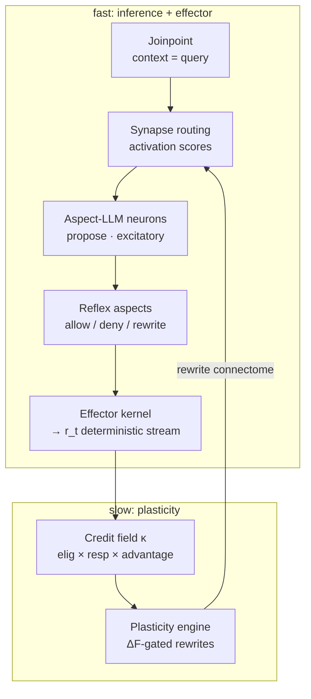

# OpenCOAT v0.3 系统架构:形态发生连接组(MAN)

> 状态:架构草案(v0.3 方向)。这是工程布局文档,配套两份姊妹文档:
> [`morphogenetic-aspect-agent.md`](morphogenetic-aspect-agent.md)(形式纲要)与
> `morphogenetic-aspect-agent-paper.tex`(论文草稿)。
> 它在 [`v0.2-system-design.md`](v0.2-system-design.md) 的工程骨架之上,提出从"建议式运行时"到"闭环连接组"的重设。

---

## 1. 一个结构性改变,两条公理

现状(v0.2):OpenCOAT 是**建议式 + 协作式**运行时——weaver 产出 `ConcernInjection` 负载,外部宿主*可能*采纳;DCN 靠启发式(decay/merge)演化;效应器是宿主的,运行时拿不到干净的结果信号。由此带来三个已知弱点:协作式(只有宿主调 guard 才生效)、fail-open、只有 OpenClaw 真接。

**2026-05 进展 (v0.3 (i) 试点,仍协作式):** HyperdustLabs OpenClaw fork 已 emit `queue_before_enqueue` / `queue_after_enqueue`; OpenCOAT bridge `queue_guard` 可在 daemon RPC 路径上 **block / rewrite** 入队 prompt。这**不是** §10 的 in-proc 权威 `ReflexMonitor`,仍是 fail-open 协作 guard。见 [joinpoint model §4.1 / §5.7 / Appendix E](./opencoat-openclaw-joinpoint-model-v0.1.md).

v0.3 只动两处,互为补充的两半:

- **公理 A(闭环)**:自建效应器 → 产出*确定的*结果流 `r_t`(reflex 的 allow/deny/repair、verifier 判决);可塑性律消费 `r_t` 学突触。缺效应器 → 拿不到干净 `r_t`;缺可塑性律 → 效应器结果只是日志,不回流成权重。两半合起来,才是"会随环境学习适应的皮层"第一次有了确定、可度量的实现路径。
- **公理 B(一张网的细胞类型;(i)→(ii) 是发育)**:三个"平面"不再分离,而是同一连接组里的细胞类型。深度=1 即架构 (i);加节点、aspect-of-aspect 加深 → (ii)。同一条可塑性律全程不变。

---

## 2. 数据/控制流(闭环)



两半的接缝在 `EFF → CR`:效应器内核产出 `r_t`,信用场把它分配到突触,可塑性引擎据此改写连接组。

---

## 3. 细胞类型 = 组件(接口签名草案)

签名用 Python 风格类型草图(仓库即 Python);非最终 API。

### 3.1 连接组状态

```python
class Aspect:                       # 节点
    id: str
    tau: str                        # 符号身份(可读、可编辑)
    neuron_type: Literal["excitatory", "inhibitory"]
    params: dict                    # 增益 g、可学路由参数等
    buffer: Deque[Sample]           # (phi, activation, r) 滑窗

class Synapse:                      # 有向边
    src: str; dst: str
    w: float                        # 可学权重
    e: float                        # 资格迹
    pointcut: Pointcut              # 内容条件化路由谓词

class Connectome:                   # = DCN 图(复用 DCNStore)
    aspects: dict[str, Aspect]
    synapses: list[Synapse]
    reflex_core: frozenset[str]     # 保守核(不可随机改写)
```

### 3.2 兴奋性 aspect-LLM 神经元(推理)

```python
class ExcitatoryNeuron(Aspect):
    def propose(self, ctx: Context) -> Candidate:
        # ctx = 路由进来的上下文 + 织入的 advice
        # 返回候选动作/文本(可为一次 LLM 调用)
        ...
```

### 3.3 抑制性反射 aspect(确定性引用监视器)

```python
class InhibitoryReflex(Aspect):
    def mediate(self, action: Action, state: State) -> Decision:
        # Decision = Allow | Deny(reason) | Rewrite(action')
        # 确定性谓词;安全关键 → fail-closed
        ...
```

### 3.4 突触路由(注意力 / 权重)

```python
class Router:
    def route(self, jp: Joinpoint) -> list[tuple[Aspect, float]]:
        # 返回 (aspect, activation_score) —— 复用 ConcernVector.activation_score
        ...
```

### 3.5 效应器内核(新——自建效应器,产出 r_t)

```python
class EffectorKernel:
    def run_turn(self, jp: Joinpoint) -> Outcome:
        # 1) route → 2) excitatory.propose → 3) inhibitory.mediate(边界闸门)
        # 4) verifier 校验 → 5) propose-check-repair 回合
        # 发射:动作结果 + 确定性 r_t + JSONL 可重放日志
        ...
```

### 3.6 信用场 + 可塑性引擎(新——取代启发式 meta 治理)

```python
class CreditField:
    def attribute(self, outcome: Outcome) -> None:
        # κ(a) += (r - b) · e_a · rho_a ;  κ(s) += (r - b) · e_s
        # 守恒:Σ_a κ_a = r - b

class PlasticityEngine:
    def step(self, scale: Literal["warm", "cold"]) -> list[Rewrite]:
        # 以速率 min(1, exp(-ΔF/T)) 接受改写
        # 原语:connect / prune / reweight / split / lift / merge
```

---

## 4. 一回合的时序

1. `Joinpoint` 事件携带上下文 `φ`(= query)。
2. `Router` 用 pointcut 匹配候选,给出 `activation_score`(突触发放)。
3. 兴奋性 aspect-LLM `propose` 候选(weaver 仍负责为其组合 prompt 注入)。
4. 抑制性反射在节点间与效应边界 `mediate`(allow/deny/rewrite)。
5. `EffectorKernel` 跑 verify → repair,执行动作面(工具/内存写/消息),发射 `r_t` + 日志。
6. `CreditField.attribute` 把 `r_t` 分到突触/节点(资格迹 × 责任 × 优势,守恒)。
7. `PlasticityEngine`(温:reweight/connect/prune;冷:split/lift/merge + tier-2 校准)改写连接组。
8. 下一回合用更新后的图。

---

## 5. 三时间尺度 → 运行时落点

| 尺度 | 跑什么 | 现有落点 |
|---|---|---|
| 快(每轮) | 推断 + 资格迹累积 | `loops/event_loop` |
| 温(近线) | reweight / connect / prune | daemon 工作线程 |
| 冷(心跳) | split / lift / merge + tier-2 校准 + 稳态归一 | daemon `tick()` / heartbeat(M6) |

M6 的 `DecayWorker`/`MergeArchiver` 不丢弃,降级为可塑性的**稳态/剪枝那一半**;缺的增强(LTP)+ 资格迹由可塑性引擎补上。

---

## 6. 与现有包的对应

| 处置 | 组件 |
|---|---|
| **复用** | `DCNStore`、JSONL replay(=可塑性可重放确定性基础设施)、`ConcernVector.activation_score`、`pointcut` 策略、`weaving/weaver`(为兴奋神经元组合注入) |
| **改** | `Concern` → 加 `neuron_type` 与可学参数;`advice/TOOL_GUARD` + 宿主 `tool_guard.py` → 提升为效应器内**权威**反射(不再"宿主可能尊重");`meta/*` + heartbeat worker → 并入可塑性引擎 |
| **新增** | **效应器内核**(propose-check-repair + 动作面 + verifier + `r_t` 发射);**信用场 κ**;**ΔF 改写引擎**(split/lift/connect/prune/reweight/merge) |

关键收益:自建效应器把 `BLOCK` 从"宿主可能尊重"变为"按构造拦得住",一举解决协作式与 fail-open。

---

## 7. (i)→(ii) 迁移阶段(发育,非重写)

1. **(i) 现可建**:1 个兴奋 aspect-LLM + 一圈抑制反射 + 可学路由。= 现状收回效应器 + 装闭环。
2. **加宽**:多兴奋神经元,按 pointcut 分流(MoE 式条件计算)。
3. **加深**:`lift`(aspect-of-aspect)长出高阶神经元,神经元彼此路由 → (ii) 连接组。
4. 全程**同一条可塑性律**,从"门控一个 LLM"扩展到"给整张 LLM-神经元网布线"。

---

## 8. 不变量与安全

- 保守核反射 aspect(brainstem)不可被随机改写。
- 安全关键动作 fail-closed(与 v0.2 现状的 fail-open 相反)。
- tier-1 可塑性可重放确定(给定日志 + 常数,结构轨迹逐字节复现)。
- 细化(split)/ 恒等初始化(lift)保证改写在区域外不改变行为。

---

## 9. 残差与开放问题

- 软 advice 因果不透明 ⇒ 软神经元信用是统计的(论文 §9 那条主线)。把软织入尽量换成硬反射,既提升可靠性又让信用变干净——同一个动作。
- 两道荷载关:信用清洗的干净度;特征 `φ` 的获取/生长(后者是元结构学习)。
- 多节点跨图信用分配在长视野下噪声大;tier-2 反事实校准昂贵。

---

## 10. OpenClaw → 效应器内核改造(权威反射监视器)

OpenClaw 是改造成效应器内核(§3.5)最务实的底座:它已提供真在驱动 LLM 的回合,且 `hook-bindings.ts` 的 `HookKind` 已天然枚举出反射闸门 + 注入点 + 结果流。落 (i) 不是从零造 agent,而是把 OpenClaw 现有的**协作式** hook 提升为**权威、in-proc、安全关键 fail-closed**,再补 verify→repair 与 `r_t` 发射。

**本节描述目标态。** 当前实现分期见 **§10.5**; 连线层 hook 表见 [joinpoint model §4.1](./opencoat-openclaw-joinpoint-model-v0.1.md#41-mvp-emit-status-bridge-integrationsopenclaw-opencoat-bridge).

### 10.1 改造四步与 hook 落点

| 步骤 | OpenClaw hook | 改造 |
|---|---|---|
| 1. 权威反射 | `before_tool_call` / `message_sending` / `subagent_spawning` / `queue_before_enqueue` | 把 `tool_guard.py` 的 `ToolGuardOutcome` 从"建议"变"裁决";**in-proc**(不走 daemon RPC);安全关键 fail-closed |
| 2. verify→repair | `before_agent_reply` | 回复前跑 OpenCOAT `verifier`;失败则约束并重提示一次 |
| 3. `r_t` 发射 | `after_tool_call` / `llm_output` / `agent_end` | 把 decision + 判决汇成结构化 `r_t`,写 JSONL replay |
| 4. 可塑性消费 | daemon `tick()` | daemon 只跑 `PlasticityEngine` 的 reweight 子集,消费 `r_t` |

\* Step 1 中 **`queue_before_enqueue` 已在 fork 落地**,但 bridge 仍走 **daemon RPC 协作 guard** (非 in-proc TCB). `tool` / `message` / `subagent` 同理.

**in-proc 红利**:`before_message_write` / `tool_result_persist` 这些之前因"同步热路径不能 await daemon RPC"被 `SKIPPED_HOOKS` 跳过的 hook,在监视器进程内同步运行后,**可重新纳入守护**(内存写/工具结果落盘也能 gate). **今天仍 skip** — 待 ReflexMonitor 落地.

### 10.2 权威反射监视器接口(小可信核)

```python
@dataclass(frozen=True)
class Action:                       # 类型化、结构化的待执行动作
    kind: Literal["tool_call", "message_send", "subagent_spawn",
                  "queue_enqueue", "memory_write"]
    name: str
    args: Mapping[str, Any]
    resource_scope: frozenset[str]  # 触及的资源/能力
    risk_tags: frozenset[str]       # {"external_write","irreversible","spend",...}
    raw: Any                        # 宿主原生句柄(供 rewrite 透传)

@dataclass(frozen=True)
class State:                        # 只读上下文快照(谓词可读)
    session_id: str; turn_id: str
    features: Mapping[str, Any]

class Decision: ...                 # 和类型:Allow | Deny | Rewrite
@dataclass(frozen=True)
class Allow(Decision): ...
@dataclass(frozen=True)
class Deny(Decision):    reason: str; policy_id: str
@dataclass(frozen=True)
class Rewrite(Decision): action: Action; reason: str; policy_id: str

class ReflexPolicy(Protocol):      # = 一个抑制性 aspect 的确定性规则
    id: str
    criticality: Literal["safety_critical", "advisory"]
    def applies(self, a: Action, s: State) -> bool: ...     # 廉价谓词
    def decide(self, a: Action, s: State) -> Decision: ...  # 确定性,无 LLM/IO

class ReflexMonitor:               # 小可信核(TCB)
    def __init__(self, policies: Sequence[ReflexPolicy],
                 *, conserved_core: frozenset[str]): ...
    def mediate(self, a: Action, s: State) -> tuple[Decision, DecisionRecord]:
        # 完全中介:每个被守护边界都经此。纯函数 → 可重放。
        ...
```

### 10.3 关键语义

- **完全中介(complete mediation)**:每个被守护边界必须调 `mediate`,宿主不得有绕过它执行守护动作的路径。可用插桩检验("是否每次工具调用都过了 mediate")。
- **决策格**:`Deny > Rewrite > Allow`;任一 safety_critical 的 `Deny` 取胜(最严);多条 `Rewrite` 按 `policy_id` 定序合成,冲突则降为 `Deny`。定序保证可复现。
- **fail-closed(反转现状)**:safety_critical 策略出错/超预算/监视器不可用 → `Deny`;advisory 出错 → 跳过该策略(仅 advisory 允许 fail-open)。这正是把现状 bridge 的 `return {}`(全线放行)反过来。
- **确定性**:`mediate` 是 `(policies, action, state)` 的纯函数——无 LLM、无 I/O、无 wall-clock 分支 → 逐回合可重放。
- **in-proc 预算**:每次 `mediate` 有硬 CPU 预算(谓词 O(policies),无网络);超预算按出错处理(safety_critical → Deny)。
- **审计/信用**:每次 `mediate` 发 `DecisionRecord`(turn、action 摘要、decision、policy_id、reason、criticality)进 `r_t` 流与 JSONL。硬中介 = 干净信用(论文 §9)。
- **保守核**:`conserved_core` 的 policy id 不可被 `PlasticityEngine` 改写(brainstem)。

### 10.4 语言/进程边界

监视器要在 OpenClaw 进程内同步运行才能权威 + 低延迟,而 OpenClaw 插件是 TS/Node。落法:**小可信核用宿主语言(TS,bridge 内)实现**,评估一份从 OpenCOAT 导出的**可移植策略规格**(确定性谓词 + criticality);**重学习(Python `PlasticityEngine`)留在 daemon**。即"小可信核在宿主侧,大学习在进程外"——与 §5 三时间尺度一致(热路径 in-proc,温/冷在 daemon)。

### 10.5 实现分期 (2026-05)

| OpenClaw hook | Joinpoint | 协作式 bridge | 权威 ReflexMonitor (v0.3 交付) |
|---|---|---|---|
| `before_tool_call` | `tool.before_call` | daemon RPC **or in-proc TCB** | in-proc fail-closed ✅ |
| `message_sending` | `response.before_final` | outbound cancel (协作) | in-proc deny + **verify→repair** ✅ |
| `subagent_spawning` | `task.before_create` | spawn veto (协作) | in-proc deny ✅ |
| `queue_before_enqueue` | `queue.before_enqueue` | **fork hook + `queue_guard`** | in-proc deny ✅ |
| `before_message_write` | `memory.before_write` | *(in-proc only)* | in-proc sync deny/rewrite ✅ |
| `tool_result_persist` | — | *(in-proc only)* | in-proc sync rewrite ✅ |
| `after_tool_call` / `llm_output` / `agent_end` | observe JPs | DCN observe | **`r_t` emit** ✅ |

Dogfood (queue collaborative guard): [`examples/09_queue_hook_dogfood`](../../examples/09_queue_hook_dogfood/README.md). Full mapping: [joinpoint model Appendix E](./opencoat-openclaw-joinpoint-model-v0.1.md#appendix-e--v03-action--a_reflex-mapping).

---

## 11. 下一步

**v0.3 phase-2 已交付 (2026-05)** — 见 [`v0.3-delivery-status.md`](../07-mvp/v0.3-delivery-status.md)。

后续:

0. ~~文档对齐 + queue dogfood 收尾~~ ✅
1. ~~效应器 TCB 原型 + `PlasticityEngine` reweight~~ ✅ (warm + cold lift/archive)
2. ~~`r_t` JSONL + daemon 消费~~ ✅
3. ~~**connectome split** 完整实现~~ ✅ (cold keyword split + domain conservation; tier-2 ΔF 校准仍 future)
4. ~~JSONL replay 可塑性单测~~ ✅
5. ~~**EffectorKernel.run_turn** 全回合闭环~~ ✅ (`opencoat_runtime_core/effector/`)
6. ~~**Architecture (ii)** 多神经元路由 + 图演化~~ ✅ (`connectome/router.py`, `synapse_evolution.py`, pipeline 集成)
7. **24h live soak** 运维验收 (`examples/07_meta_governance_soak`)
8. **Fork effector** 单回合多 `ExcitatoryNeuron.propose`（daemon 侧路由/图已落地）
